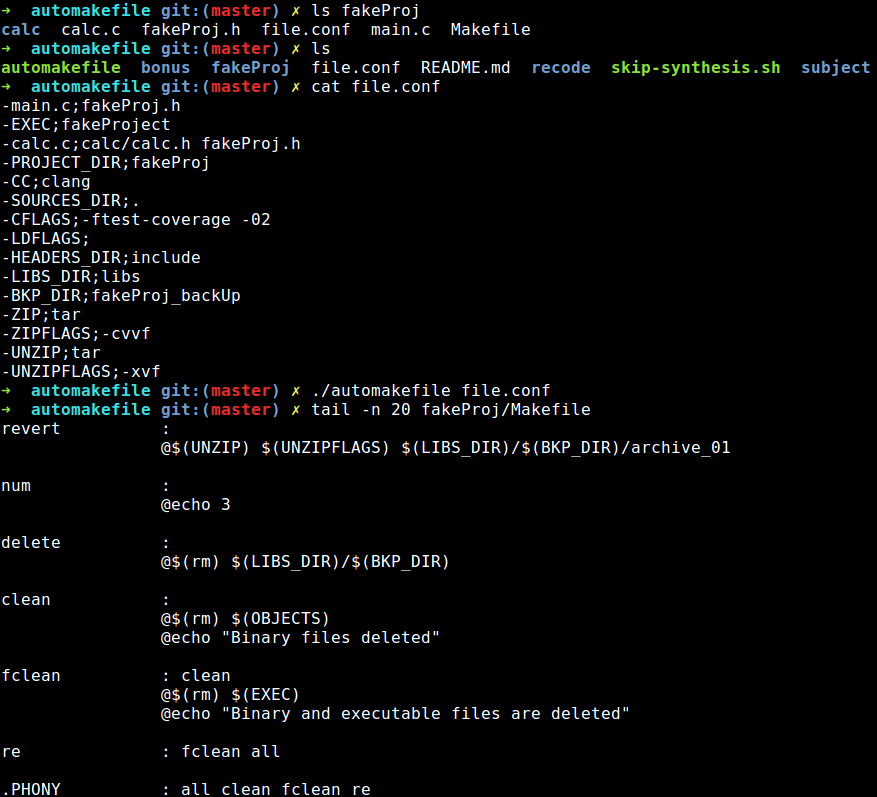

# automakefile
Epitech first year project : automakefile

Deadline : 5 days

Beginning of the project : 27/06/2016, 08h00

Group size : 1 person

# automakefile

Write a shell script named automakefile, that will generate a nice Makefile given a configuration file.

This configuration file can contain the following (potentially unordered) lines:
* source_filename;dependence1 dependence2 ...(specify the full names of the files, from the header subfolder
below)
* PROJECT_DIR;name_of_the_project_root_folder
* SOURCES_DIR;subfolder_containing_the_source_files
* HEADERS_DIR;subfolder_containing_the_header_files
* LIBS_DIR;subfolder_containing_librairies
* EXEC;executable_name
* CC;compilator_binary
* CFLAGS;compilation_flag1 compilation_flag1...
* LDFLAGS;linking_flag1 linking_flag2 ...

## Getting started

These instructions will allow you to obtain a copy of the operational project on your local machine for development and testing purposes.

### Prerequisites

What do you need to install the software and how to install it?

```
gcc
make
```

### Installation

Here's how to start the project on your computer

Clone and go in the directory automakefile

Project compilation

```
make
```

Running project

```
./automakefile file.conf
```


## Screenshot



## Build with

* [C](https://en.wikipedia.org/wiki/C_(programming_language))

## Auteurs

* **David Munoz** - [DavidMunoz-dev](https://github.com/davidmunoz-dev)
